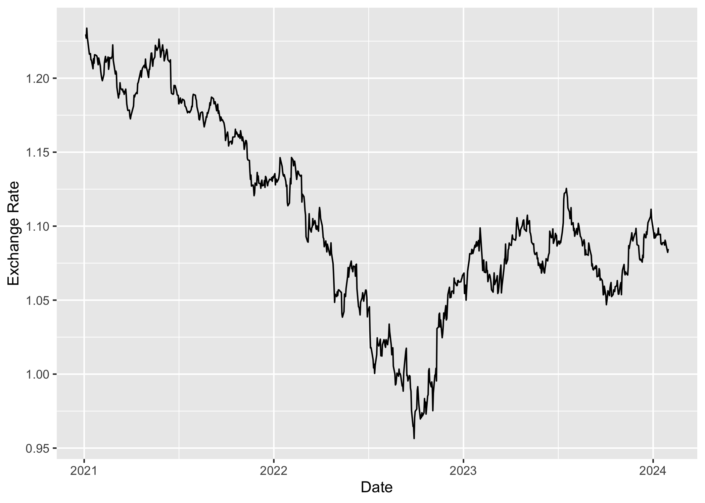

<!-- README.md is generated from README.Rmd. Please edit that file -->

# ecbr

<!-- badges: start -->

[](https://lifecycle.r-lib.org/articles/stages.html#experimental)
[](https://github.com/m-muecke/ecbr/actions/workflows/R-CMD-check.yaml)
<!-- badges: end -->

The goal of ecbr is to provide a simple interface to the [ECB
API](https://data.ecb.europa.eu/help/api/overview). The main difference
to other packages is that it’s a modern implementation using the
[httr2](https://httr2.r-lib.org) package.

## Installation

You can install the development version of ecbr from
[GitHub](https://github.com/) with:

``` r
# install.packages("pak")
pak::pak("m-muecke/ecbr")
```

## Usage

``` r
library(ecbr)

# fetch US dollar/Euro exchange rate
fx_rate <- ecb_data("EXR", "D.USD.EUR.SP00.A", start_period = "2021-01-01")
fx_rate
#> # A tibble: 793 × 6
#>   date       title          description                    unit  frequency value
#>   <date>     <chr>          <chr>                          <chr> <chr>     <dbl>
#> 1 2021-01-04 US dollar/Euro ECB reference exchange rate, … USD   daily      1.23
#> 2 2021-01-05 US dollar/Euro ECB reference exchange rate, … USD   daily      1.23
#> 3 2021-01-06 US dollar/Euro ECB reference exchange rate, … USD   daily      1.23
#> 4 2021-01-07 US dollar/Euro ECB reference exchange rate, … USD   daily      1.23
#> 5 2021-01-08 US dollar/Euro ECB reference exchange rate, … USD   daily      1.23
#> # ℹ 788 more rows

library(ggplot2)

title <- fx_rate[1, "title", drop = TRUE]
subtitle <- fx_rate[1, "description", drop = TRUE]

ggplot(fx_rate, aes(x = date, y = value)) +
  geom_line() +
  labs(x = "", y = "", title = title, subtitle = subtitle) +
  theme_minimal()
```



## Related work

- [ecb](https://github.com/expersso/ecb): R interface to the European
  Central Bank’s Statistical Data Warehouse (SDW) API
