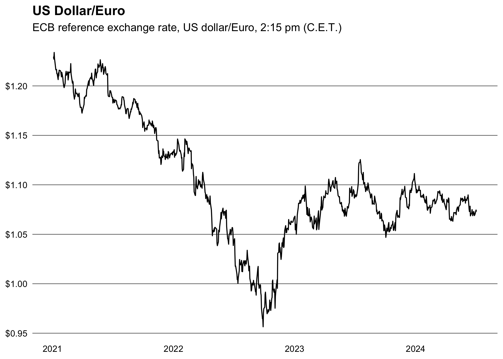

<!-- README.md is generated from README.Rmd. Please edit that file -->

# ecbr

<!-- badges: start -->

[](https://lifecycle.r-lib.org/articles/stages.html#experimental)
[](https://github.com/m-muecke/ecbr/actions/workflows/R-CMD-check.yaml)
<!-- badges: end -->

ecbr is a minimal R client for the [ECB
API](https://data.ecb.europa.eu/help/api/overview).

## Installation

You can install the development version of ecbr from
[GitHub](https://github.com/) with:

``` r
# install.packages("pak")
pak::pak("m-muecke/ecbr")
```

## Usage

``` r
library(ecbr)

# fetch US dollar/Euro exchange rate
fx_rate <- ecb_data("EXR", "D.USD.EUR.SP00.A", start_period = "2021-01-01")
fx_rate
#> # A tibble: 851 × 6
#>   date       title          description                    unit  frequency value
#>   <date>     <chr>          <chr>                          <chr> <chr>     <dbl>
#> 1 2021-01-04 US dollar/Euro ECB reference exchange rate, … USD   daily      1.23
#> 2 2021-01-05 US dollar/Euro ECB reference exchange rate, … USD   daily      1.23
#> 3 2021-01-06 US dollar/Euro ECB reference exchange rate, … USD   daily      1.23
#> 4 2021-01-07 US dollar/Euro ECB reference exchange rate, … USD   daily      1.23
#> 5 2021-01-08 US dollar/Euro ECB reference exchange rate, … USD   daily      1.23
#> # ℹ 846 more rows
```



## Related work

- [ecb](https://github.com/expersso/ecb): R interface to the European
  Central Bank’s Statistical Data Warehouse (SDW) API.
- [rsdmx](https://github.com/opensdmx/rsdmx): R package for reading SDMX
  data and metadata.
- [readsdmx](https://github.com/mdequeljoe/readsdmx): R package for
  reading SDMX data and metadata.
- [pdfetch](https://github.com/abielr/pdfetch): R package for
  downloading economic and financial time series from public sources.
